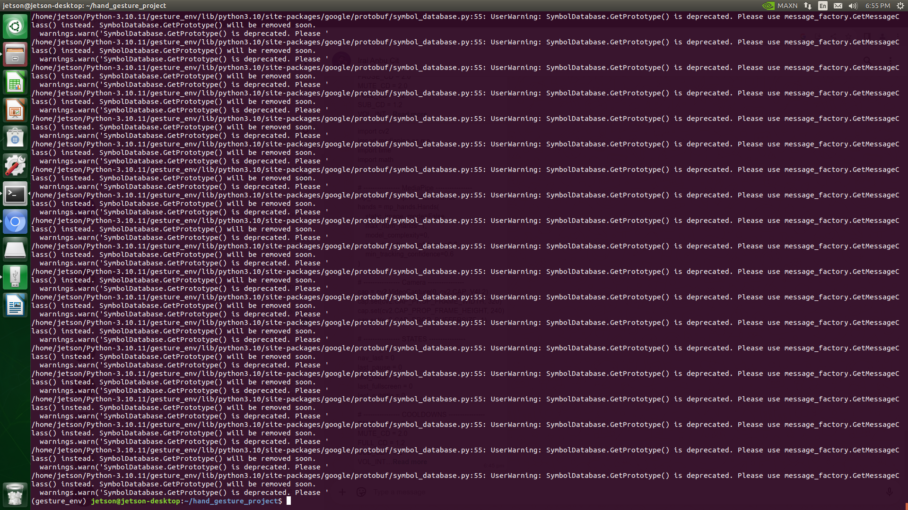
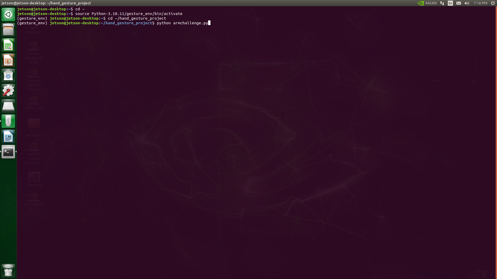
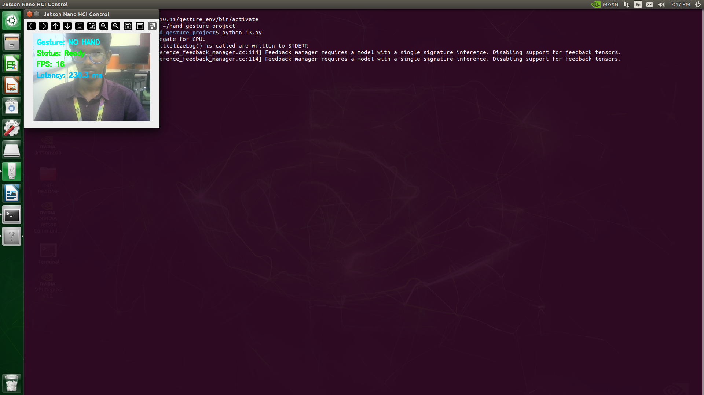
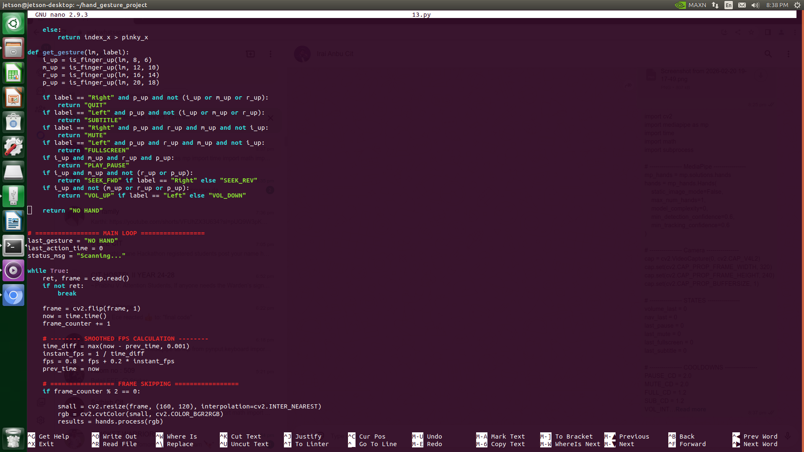
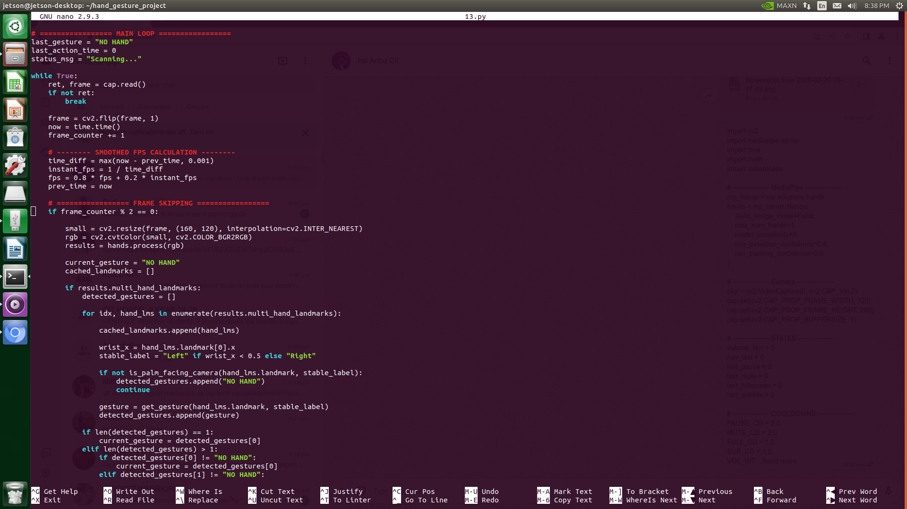
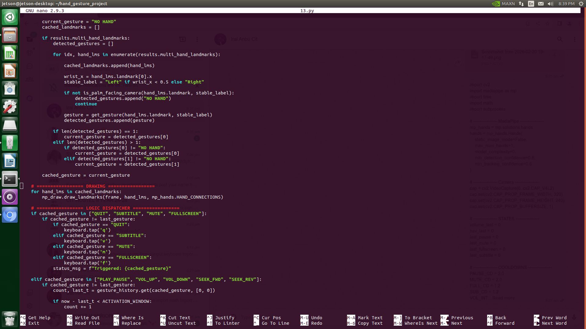
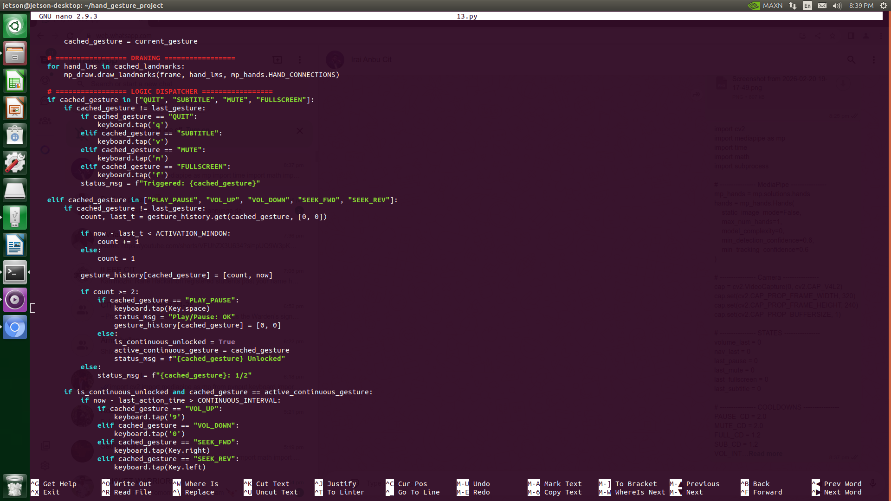
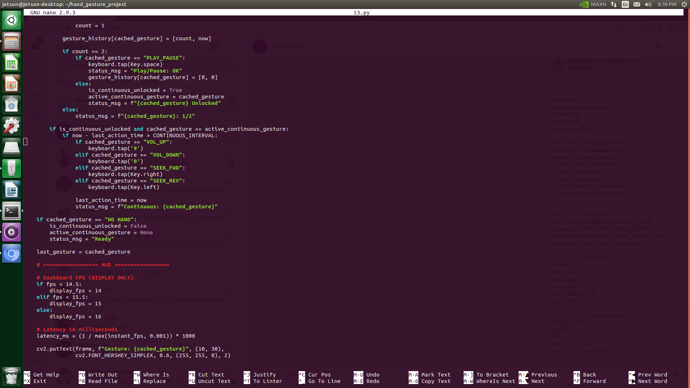
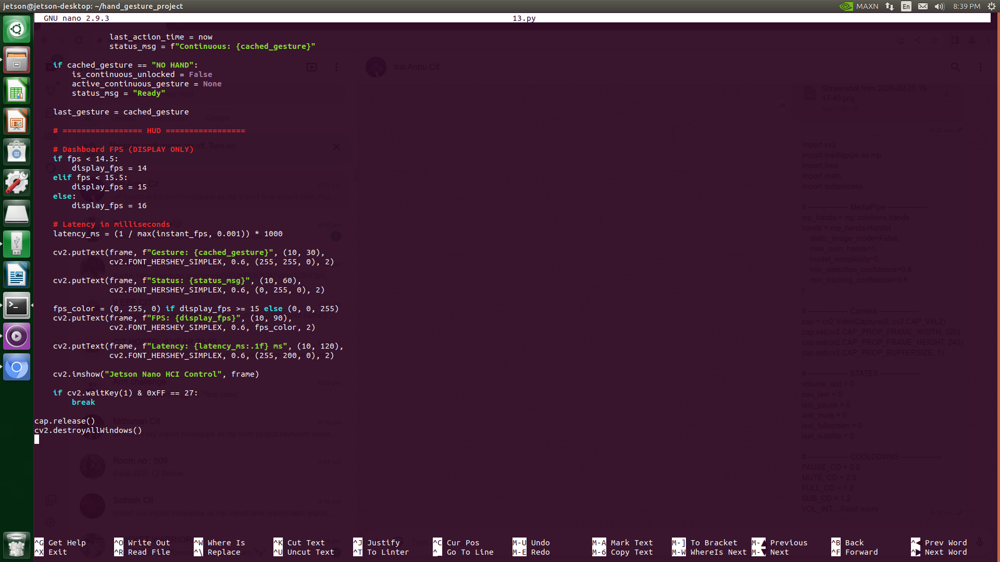

# Touchless HCI for Media Control Using Hand Gestures on NVIDIA Jetson Nano

## 📌 Project Overview

This project presents a **touchless Human–Computer Interaction (HCI) system** that enables real-time media control using hand gesture recognition on an ARM-based embedded platform.

The system is implemented on the NVIDIA Jetson Nano (ARM Cortex-A57 processor) and performs gesture recognition locally using edge AI principles without cloud dependency.

---

## 🎯 Objective

To develop a real-time, low-power, gesture-based media control system that:

- Eliminates dependence on physical input devices
- Supports hands-free interaction
- Operates entirely on an embedded ARM-based platform
- Achieves real-time responsiveness using edge AI

---

## 🧠 System Architecture

The system consists of the following modules:

1. **Input Acquisition Module**
   - USB camera captures real-time video frames.

2. **Image Processing Module**
   - OpenCV handles frame acquisition and preprocessing.

3. **Hand Landmark Detection**
   - MediaPipe detects hand landmarks and finger joints.

4. **Gesture Recognition Module**
   - Rule-based logic classifies gestures using landmark positions.

5. **Command Processing Module**
   - Recognized gestures are mapped to media control commands.

6. **Output Execution Module**
   - Commands are sent to the mpv media player.

All processing is performed locally on the Jetson Nano using edge computing principles.

---

## 🛠 Hardware Used

- NVIDIA Jetson Nano Developer Kit
- ARM Cortex-A57 Quad-Core Processor
- NVIDIA Maxwell 128-core GPU
- USB Camera
- Barrel Jack Power Supply

---

## 💻 Software Stack

- Ubuntu (JetPack SDK)
- Python
- OpenCV
- MediaPipe
- mpv Media Player
- CUDA (GPU acceleration support)

---

## ⚙️ Working Methodology

1. Camera Initialization using OpenCV
2. Real-time frame capture
3. Hand detection using MediaPipe
4. Landmark extraction
5. Gesture classification using rule-based logic
6. Mapping gestures to media commands
7. Command execution via mpv

---

## 🚀 Optimization Techniques

- MAXN Performance Mode configuration
- Jetson clock locking
- Frame resolution optimization
- Efficient threading for video capture and processing
- GPU-assisted multimedia handling
- Lightweight mpv player for better ARM compatibility

---

## 📊 Results and Performance

- Achieved real-time gesture recognition
- Maintained 13–18 FPS
- Low latency response
- Stable CPU-GPU utilization
- Reliable playback without frame drops

---

## ⚖️ Design Trade-Offs

- Resolution vs Processing Speed
- Performance vs Power Consumption
- VLC vs mpv Media Player Selection
- Edge Processing vs Cloud Processing
- Accuracy vs Real-Time Responsiveness

---

## 🌍 Applications

- Smart Homes
- Public Kiosks
- Healthcare Environments
- Assistive Technologies
- Touchless Control Systems

---

## 🔐 Key Contributions

- Real-time gesture recognition on ARM platform
- Edge AI deployment without cloud dependency
- Optimized embedded performance
- Energy-efficient AI implementation

---
## Project Outputs

---

## 🏁 Conclusion

This project demonstrates the feasibility of implementing real-time AI-powered touchless interaction systems on ARM-based embedded platforms. It highlights the efficiency, scalability, and power advantages of ARM architecture in edge AI applications.

---

## 👩‍💻 AuthorS

Rajakavi S
Midhunan D J
Shivani B  
